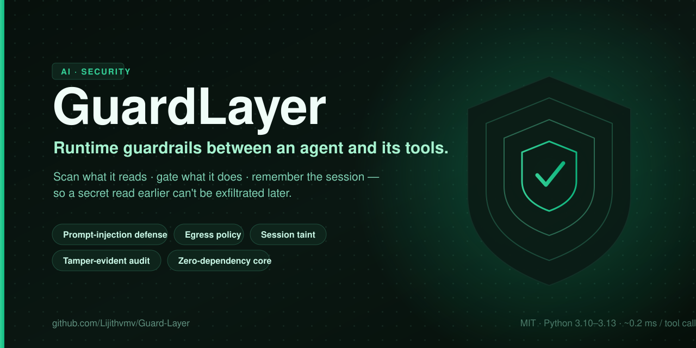

<p align="center">
  
</p>

# GuardLayer

> Stop an AI agent from doing harm after it reads something an attacker wrote.

GuardLayer sits between an agent and its tools. It checks what the agent **reads**, decides whether what it is about to
**do** may run, needs a human, or is refused, and remembers what the session has already seen, so an action is judged in
context. Pure Python, zero dependencies, about 0.2 ms per tool call in-process.


**Documentation: https://lijithvmv.github.io/Guard-Layer/**

## Why this approach

Any text an agent reads (a web page, an email, an issue, a tool result) can carry instructions, and the model can't
reliably tell them apart from yours. Detectors help, but on attacks they have never seen they catch a minority (our own
held-out numbers are below). So GuardLayer does not bet on detection. It stops the **harm**:

1. **What the agent reads** is scanned for injections, secrets and personal data, and the session remembers it:
   untrusted content, an injection, sensitive data.
2. **What the agent is about to do** goes through a tool policy: destructive commands, credential files, exfiltration
   endpoints, and your own argument rules.
3. **The two meet in the session:** a secret read earlier and now being sent out is blocked; any side effect after the
   agent read an injection needs a human; untrusted content plus sensitive data plus a network call needs a human. This
   works even when the injection itself was never detected.
4. Every decision goes to a tamper-evident audit log.

## Quickstart: Claude Code

```toml
# pilot.toml: record what would happen, enforce nothing
preset = "observe"

[audit]
path = "pilot-audit.jsonl"
min_verdict = "allow"
```

```bash
pip install guardlayer
guardlayer --config pilot.toml hook claude-code --print-config     # merge into the project's .claude/settings.json
guardlayer audit report pilot-audit.jsonl --since-days 1           # what it would have stopped or asked, daily
```

Nothing is blocked in `observe` mode. After a week of real work, switch the preset to `balanced`. The hook only
ever tightens Claude Code's own permissions (it returns `deny` or `ask`, never `allow`). Each hook call starts a Python
process (about 0.6 s on Windows); add `--server` for a background GuardLayer that answers in about 10 ms. See the [pilot guide](https://lijithvmv.github.io/Guard-Layer/getting-started/pilot/).

## Quickstart: your own agent

```python
from guardlayer import GuardLayer

guard = GuardLayer.from_preset("balanced")
session = guard.session(conversation_id)

# after a tool runs, before the model reads the result
result = session.scan_tool_result("read_email", email_text)
email_text = result.text                      # secrets redacted; withhold it if result.is_blocked

# before a tool runs
check = session.scan_tool_call("send_email", {"to": to, "body": body})
if check.is_blocked:
    refuse(check)
elif check.needs_review and not ask_a_human(check):
    refuse(check)
```

LangGraph, the OpenAI Agents SDK and any other framework have ready-made wrappers:
[integrations](https://lijithvmv.github.io/Guard-Layer/integrations/any-framework/).

## Describe your tools

This is where most of the protection comes from. Out of the box, GuardLayer guesses from tool names (`bash` runs
commands, `http_get` reaches the network) and treats unknown tools as able to do anything. Telling it the truth, once per
tool, makes it both safer and quieter:

```toml
# guardlayer.toml
preset = "balanced"

[tool.read_email]
output = "untrusted"               # others can write what it returns

[tool.send_email]
capabilities = ["network"]
accepts_untrusted = false          # a session that read untrusted content may not drive it
arguments = [{ argument = "to", allow = ["*@mycompany.com"], action = "review" }]
```

`guardlayer --config guardlayer.toml policy check` lists every tool and what GuardLayer assumes about it.
All keys: [configuration](https://lijithvmv.github.io/Guard-Layer/operations/configuration/).

## What the evidence says

Everything below is reproducible from `benchmarks/`; the full write-up, including what is *not* a fair test, is in
[Evaluation](https://lijithvmv.github.io/Guard-Layer/evaluation/).

| Test | Result | How much to trust it |
|---|---|---|
| Detection, held-out public datasets (never used to tune) | recall 0.23 (deepset), 0.57 (Gandalf), 0.21 (SPML), 0.72 (jailbreak-classification); **no false positives** on about 7,200 normal texts | solid; shows detection alone is not enough |
| Detection, LLMail-Inject attacks that hijacked a real model, held-out teams | 44.5% caught, 0 false positives on its normal emails | solid for email-style injection |
| AgentDojo (ETH Zurich), all four suites, local 7B model | attacks that worked: banking 7→0, Slack 4→0, workspace 1→0, travel 3→0 (out of 10 each); normal tasks: banking 6→5, Slack 8→6, workspace and travel unchanged | **small**: 40 of 949 attack pairs, one attack style that the rules were fixed on, one model |
| ADR-Bench (Uber): 303 recorded sessions with 134 MCP servers, replayed, no tools declared | 0.8.0: 16% of normal sessions interrupted. **0.8.1: 4%** on the held-out half (5 of 118); 0 of 23 malicious sessions | third-party, real tool output. The malicious cases are malicious tool servers with normal-looking output: undeclared, GuardLayer can't tell them apart |
| Tool policy, everyday dev commands | 31 of 31 attack commands caught, 0 of 23 normal commands flagged | small, hand-made |

Not measured yet: a large AgentDojo run across many attack styles, other models, and real users. When an attack is
caught in a tool result, the result is withheld, so the agent usually can't finish the user's task in that case.

## What it doesn't do

- It lowers risk; it doesn't make prompt injection impossible. Signature rules can be paraphrased around.
- It only sees what passes through it: tools you don't route through GuardLayer aren't guarded.
- An injection that stays within what the task allows (a wrong but permitted recipient, a misleading summary) needs
  argument rules or a human, not a scanner.

Assets, assumptions and residual risk: [THREAT_MODEL.md](https://github.com/Lijithvmv/Guard-Layer/blob/main/THREAT_MODEL.md).

## Core and add-ons

| Core (the product) | Add-ons (opt-in; **experimental** ones may change; see [What's stable](https://lijithvmv.github.io/Guard-Layer/reference/stability/)) |
|---|---|
| Tool-call policy, session tracking and labels, content scanners (injection, secrets, PII, links, obfuscation), presets and observe mode, audit log, Claude Code hook, Python API, LangGraph and OpenAI Agents SDK wrappers | Compliance evidence export (OWASP, ATLAS, NIST, ISO 42001, EU AI Act mappings) · signed audit logs (`signing`) · REST API (`api`) · transformer classifier (`ml`, `multilingual`) · semantic similarity (`embeddings`) · *experimental:* task profiles, file labels, split-instruction detection, PDF/image extraction (`extract`, `ocr`), behavioural check (`check_intent`) |

## Install

```bash
pip install guardlayer                      # core, no dependencies
pip install "guardlayer[signing]"           # + Ed25519-signed audit logs
pip install "guardlayer[langgraph]"         # or [openai-agents]: framework wrappers
pip install "guardlayer[api]"               # + REST API
```

The other extras are listed in [Install](https://lijithvmv.github.io/Guard-Layer/getting-started/install/).

## Development

```bash
pip install -e ".[dev]"
pytest -q
ruff check src tests
```

See [CONTRIBUTING.md](https://github.com/Lijithvmv/Guard-Layer/blob/main/CONTRIBUTING.md) and
[SECURITY.md](https://github.com/Lijithvmv/Guard-Layer/blob/main/SECURITY.md).

## License

[MIT](https://github.com/Lijithvmv/Guard-Layer/blob/main/LICENSE) © Lijith V M
